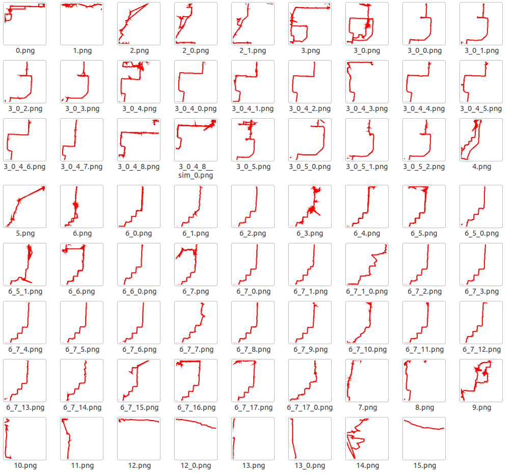

# QianMo

This routine is used to cluster tracks.The core part is to calculate the minimum common subsequence of the trajectory code.All trajectories eventually generate a trajectory family tree.

This GPS trajectory dataset was collected in (Microsoft Research Asia) [Geolife](https://www.microsoft.com/en-us/research/project/geolife-building-social-networks-using-human-location-history/?from=http%3A%2F%2Fresearch.microsoft.com%2Fen-us%2Fprojects%2Fgeolife%2Fdefault.aspx) project。